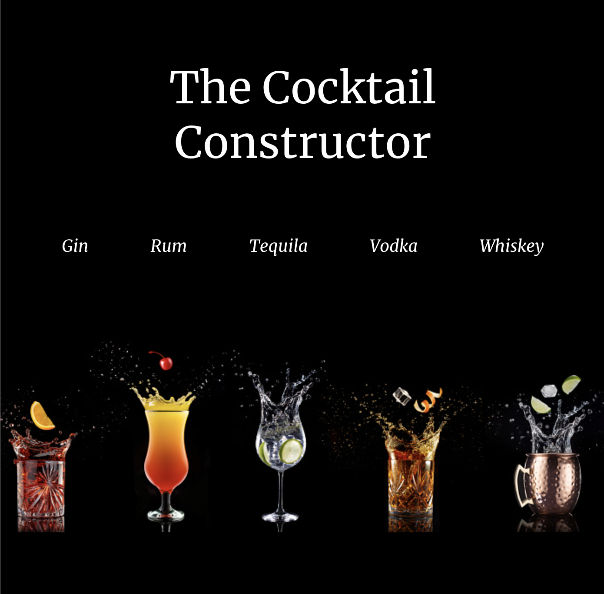

## Game Screenshots

## Description and Technologies

The Cocktail Constructor is a react app that allows users to search through a database of cocktails by liquor, search by liquor, then view the ingredients and recipe to make the drink.

## Installation Instructions

Fork the repo and clone it down to your machine, then host on a live server!

OR

View the live app [here](https://tender-mayer-377c2d.netlify.app/drinks/details/16333)

## User Stories

### MVP Goals

-As a user, I want to be able to see a list of all the cocktails I can choose from so I can select the one I want.
-As a user, I want the ability to view a specific type of cocktail by its liquor so I can narrow down my options.
-As a user, I want to be able to select a cocktail and see a list of ingredients as well as the recipe on how to create the drink.

### Stretch Goals

-As a user, I want to be limit those under 21 from viewing alcoholic drinks (US) and show them a list of non-alcoholic drinks instead.
-As a user, I want to be able to view a random drink to try 
-As a user, I want to be able to add specific ingredients to a list so I know what I need to buy to make the drink.

## Major Hurdles

- One of the biggest hurdles I ran into was with the layout of the application and which layers would attach to which component. Due to the layout of the api I needed to make these layers more specific since I did not have access to the full (paid) version of the app. 
- Because of the first hurdle, I ran into difficulties adding the additional features I initally planned on. These will be listed below and will be actively working on them when more time permits.

## Unsolved Problems

- Unsolved Error message: Currently I am receiving this error message "Warning: Can't perform a React state update on an unmounted component." I've attempted a [few fixes](https://stackoverflow.com/questions/53949393/cant-perform-a-react-state-update-on-an-unmounted-component) but kept breaking the app. Everything still renders as expected at this time.

- Favorite Drinks: I built out the the majority of the functionality for the button in one of the initial creations but ran into a problem with the route that the drinks were rendering. The main hurdle on this currently is the .map section within the list that I had previously mapped into. 

- Search Functionality: This was something that was not in the original markup that felt needed towards the end of the project week. I was struggling with fitting the search functionality within the structure already created (the drink details being attached to the browse drinks by liquor section and not fully on its own), but I'm confident this is something that could be easily added with a bit of extra attention.

- Shopping List: As I continued building out the app this component did not seem to match the themes of the app as much. While I love the idea of it, it will probably be scratched from the final version.

## Wire Frames

